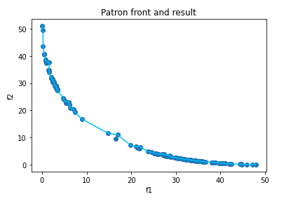

# COMM510 Coursework  Assessment
## 720072560 Ruilong Liu
## Reproduction is prohibited, this repo is only for the coursework assesment.

### TOPIC
The impact of initialisation on MOEAs. In this project topic you should explore the research
question: how much of the computational budget (objective function evaluations) should be spent on
initialisation? Typically the number of random initial solutions (if no existing solutions are usable), is
the same as the search population – however it is possible to generate substantially more initial random
solutions and take the “N” best of these to form the initial search population. You will want to explore the
effect of varying the amount of budget you assign to initialisation versus search for one or more optimisers.

### ABSTRACT
The allocation of computational budget between initialization and
search is an important consideration in multi-objective evolutionary
algorithms (MOEAs). Initialization refers to the process of generating
the initial set of solutions that will be used as the starting point
for the optimization process, while search refers to the process of
iteratively improving the solutions over time. The quality of the
initial solutions can have a significant impact on the performance of
the optimization algorithm, as it determines the direction and scope
of the search. In this report, we investigate the effect of varying the
proportion of the computational budget allocated to initialization
versus search for MOEAs. We perform experimental studies using
a range of Initialization methods and analyze the results to determine
the impact of the allocation of budget on the performance
of the optimization algorithm. My findings provide ideas into the
trade-offs between initialization and search in MOEAs and can
inform the design of optimization algorithms and the allocation of
computational resources.

